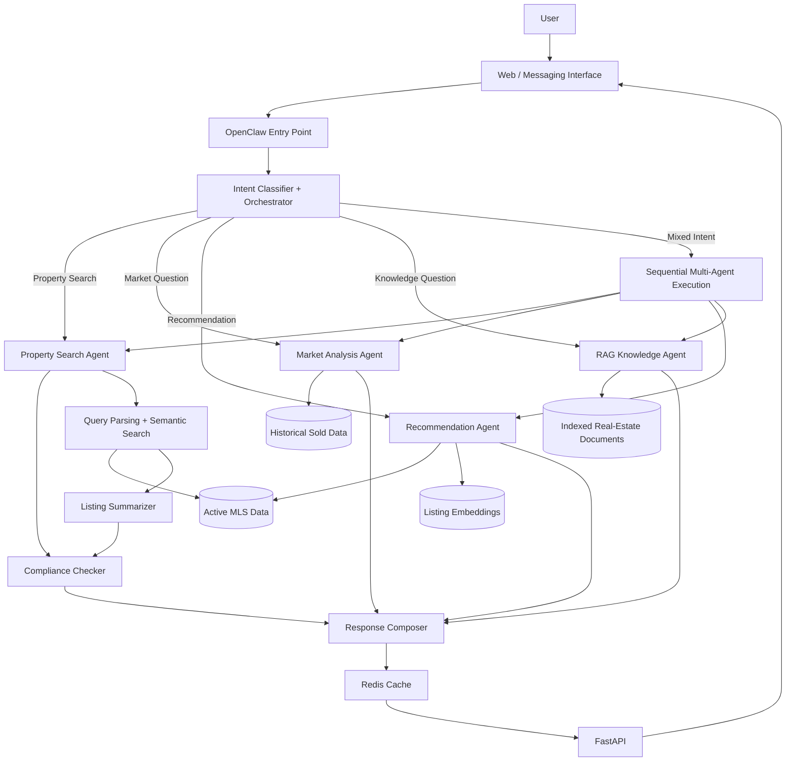

# Real Estate AI Agent

A multi-agent AI assistant for real-estate search and decision support. The system routes natural-language user requests to specialized agents for property search, market analysis, recommendations, and real-estate knowledge retrieval, while adding summarization, compliance checks, caching, and API access.

## Overview

This project was designed to answer a broader question:

> Can an AI assistant combine structured MLS data, semantic retrieval, market analytics, and real-estate knowledge into one conversational workflow?

Instead of building a single chatbot that tries to handle everything, the system uses an orchestration layer to identify the user's intent, route the request to the appropriate agent, and combine the results into one response.

The project works with large MLS datasets, including active property records and historical sold-property data.

## Key Features

- **Natural-language property search** using structured filters and semantic retrieval
- **Market analysis** using historical sold-property data
- **Property recommendation** based on listing similarity
- **RAG knowledge agent** for real-estate questions
- **Mixed-intent orchestration** for requests requiring more than one agent
- **Conversation-state handling** for property-search clarification
- **Listing summarization** for concise property descriptions
- **Housing compliance checking** before returning user-facing results
- **FastAPI backend** exposing reusable REST endpoints
- **Redis caching and rate limiting**
- **OpenClaw orchestration layer**
- **Frontend-ready architecture** for web or messaging interfaces

## System Architecture



## Request Workflow

A typical request follows this pipeline:

```text
User Query
   ↓
OpenClaw
   ↓
Intent Classification
   ↓
Orchestrator
   ↓
Select one or more specialized agents
   ↓
Agent-specific retrieval / analysis
   ↓
Summarization + compliance processing where applicable
   ↓
Compose final response
   ↓
Return through FastAPI / frontend
```

### Example 1 — Property Search

```text
"Find me a 3-bedroom home under $800k in Irvine with a pool."
        ↓
Property Search Intent
        ↓
Query Parser extracts:
- city = Irvine
- bedrooms = 3
- max_price = 800000
- feature = pool
        ↓
Structured filtering + semantic search
        ↓
Top matching listings
        ↓
Listing summarization
        ↓
Compliance check
        ↓
User-facing results
```

### Example 2 — Market Analysis

```text
"How has the Irvine housing market changed over the last 12 months?"
        ↓
Market Analysis Intent
        ↓
Historical sold-property database
        ↓
Aggregate pricing / transaction statistics
        ↓
Market trend summary
        ↓
User-facing response
```

### Example 3 — Mixed Intent

```text
"Find homes in Irvine under $800k and tell me whether prices there are trending up."
        ↓
Mixed Intent
        ↓
1. Property Search Agent
        ↓
2. Market Analysis Agent
        ↓
Combined response
```

## Main Components

### 1. OpenClaw Orchestration

OpenClaw acts as the user-facing entry point and routes each request into the project's orchestration workflow.

The orchestrator supports:

- single-intent requests
- mixed-intent requests
- sequential execution of multiple agents
- clarification flows
- continuation of pending property-search state
- unified response generation

### 2. Property Search Agent

The property-search workflow combines NLP and structured MLS fields.

Core components include:

- query parsing
- entity extraction
- structured filters
- semantic search over listing remarks
- listing summarization
- compliance validation

### 3. Market Analysis Agent

The market-analysis agent uses historical sold-property records to answer questions involving:

- market trends
- recent sales
- pricing behavior
- comparable properties
- market conditions

### 4. Recommendation Agent

The recommendation workflow starts from a property and retrieves similar candidate listings using listing embeddings and structured property information.

Example workflow:

```text
Input Listing
   ↓
Retrieve Similar Candidates
   ↓
Compare Structured + Semantic Features
   ↓
Rank Candidates
   ↓
Return Top Recommendations
```

### 5. RAG Knowledge Agent

The RAG agent retrieves relevant chunks from indexed real-estate reference documents and uses them to answer knowledge-based questions.

```text
Question
   ↓
Embedding
   ↓
Vector Retrieval
   ↓
Relevant Document Chunks
   ↓
Generated Answer
```

## Backend API

The Python backend is built with **FastAPI**.

Example endpoints include:

```text
GET  /health
POST /parse-query
POST /extract-entities
POST /search
```

The search API integrates the real-estate NLP workflow and supports caching through Redis.

## Caching and Rate Limiting

Redis is used to reduce repeated computation for identical requests.

A typical flow is:

```text
Incoming Request
      ↓
Create Request Hash
      ↓
Check Redis
   ↙         ↘
Cache Hit   Cache Miss
   ↓           ↓
Return      Run Pipeline
               ↓
             Cache
               ↓
             Return
```

Rate limiting is applied at the API layer to prevent excessive requests.

## Technology Stack

| Layer | Technologies |
|---|---|
| Orchestration | OpenClaw, TypeScript |
| Backend | Python, FastAPI |
| Data | MySQL / MLS datasets |
| Semantic Retrieval | Embeddings, vector similarity search |
| Knowledge Retrieval | RAG |
| Caching | Redis |
| API Protection | Rate limiting |
| Frontend | Web interface / messaging interface |
| Deployment | Docker-ready services |

## Project Structure

A production-oriented repository can be organized like this:

```text
real-estate-ai-agent/
│
├── backend/
│   ├── main.py
│   ├── property_search/
│   ├── summarization/
│   ├── compliance/
│   ├── recommendation/
│   └── market_analysis/
│
├── orchestrator/
│   ├── orchestrator.ts
│   ├── intent_classifier.ts
│   ├── cli.ts
│   └── SKILL.md
│
├── rag/
│   ├── build_index.ts
│   ├── retrieval.ts
│   ├── embedding.ts
│   └── generate_answer.ts
│
├── frontend/
│
├── demo/
│   └── sample_data/
│
├── tests/
│
├── docker-compose.yml
├── requirements.txt
├── .env.example
└── README.md
```

## Running Locally

### 1. Clone the repository

```bash
git clone https://github.com/YOUR_USERNAME/YOUR_REPOSITORY.git
cd YOUR_REPOSITORY
```

### 2. Create environment variables

Copy the example environment file:

```bash
cp .env.example .env
```

Add the required values locally.

**Never commit real API keys, database passwords, private MLS credentials, or proprietary datasets.**

### 3. Install backend dependencies

```bash
pip install -r requirements.txt
```

### 4. Start Redis

If using Docker:

```bash
docker compose up redis
```

### 5. Start the FastAPI backend

```bash
uvicorn main:app --reload
```

### 6. Open the API documentation

FastAPI automatically exposes interactive API documentation while the development server is running.

```text
http://localhost:8000/docs
```

## Public Demo

The full production dataset used during development should **not** be included in a public repository if it contains proprietary MLS data.

For a public recruiter demo, the recommended setup is:

```text
Recruiter
   ↓
Public Demo URL
   ↓
Frontend
   ↓
Hosted FastAPI Backend
   ↓
Demo / Synthetic Property Dataset
   ↓
Real Agent Workflow
```

This allows recruiters to interact with the actual system architecture without receiving access to private datasets or credentials.

### Suggested Demo Queries

```text
Find a 3-bedroom home under $900k.

Show me properties similar to listing DEMO-102.

What are the recent market trends in the demo city?

Find a home under $1M and also summarize the local market.

What does days on market mean?
```

## Security and Data Privacy

The public repository should contain:

- source code
- architecture documentation
- sample configuration
- synthetic or anonymized demo data
- screenshots or GIFs
- reproducible setup instructions

It should **not** contain:

- MLS credentials
- production database credentials
- API keys
- `.env`
- private user information
- proprietary MLS exports
- production Redis credentials

Recommended `.gitignore` entries:

```gitignore
.env
.env.*
*.pem
*.key
__pycache__/
node_modules/
data/private/
embeddings/private/
```

## Why This Project Matters

This project demonstrates how multiple AI and software-engineering components can be integrated into a single end-to-end product:

- natural-language processing
- structured database querying
- semantic retrieval
- retrieval-augmented generation
- recommendation systems
- multi-agent orchestration
- REST API development
- caching
- rate limiting
- AI safety / compliance checks
- frontend integration
- containerized deployment

The goal is not just to generate text, but to build an AI system capable of selecting and coordinating different tools based on what the user is trying to accomplish.

## Future Improvements

Potential extensions include:

- stronger conversational memory
- model-based reranking
- richer recommendation explanations
- map-based property visualization
- authentication
- evaluation dashboards
- automated agent-level testing
- production monitoring and observability

## Author

Built as an end-to-end real-estate AI engineering project combining data analysis, NLP, retrieval, recommendation systems, backend APIs, and agent orchestration.
